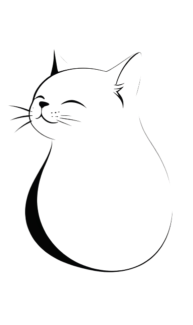

    

    富强、民主、文明、和谐、合规

    自由、平等、公正、法治、合法

    爱国、敬业、诚信、友善、合理

# ComfyUI_Coze

## 功能简述

一个调用扣子机器人的ComfyUI插件.

## 使用图例

如果想每次生成都不一样，那么请增加随机数

## Coze的限额

## 使用手册

1. 需要在Coze里创建一个Bot，可以参考BOT：https://www.coze.cn/s/i61kcb1L/；

2. 需要创建Token；

在 https://www.coze.cn/open/api 上添加令牌，保存好，以便后续使用。

3. 需要发布Bot，并勾选Bot API；

4. 需要获取Bot的ID，保存好，以便后续使用。

5. 可以在ComfyUI中使用啦。

## Bot配置举例

## 输入举例

1. “给我个有创意的提示词”；
2. “转换为chibi风格的提示词：xxxxxxxx”；
3. “优化下我的提示词：xxxxxxxx”；
4. “精简下我的提示词：xxxxxxxx”；
5. “从下面文章，帮我提炼出提示词：xxxxxxxx”；

### 举例 - 风格转换

> 使用的模型为： https://www.liblib.art/modelinfo/386109978c19484298d810d6f2830780

#### 原始提示词

A hyperrealism abstract photography with a chilling atmosphere. A Chinese teenage girl with braided black hair and wearing a red dress is the role portrait. A misty veil shrouds the scene,making it sinister and morbid. She has a baffled expression as she attempts to unravel a complex web of lies. The proportions are precise,adding to the suspense. The background is a dimly lit forest,enhancing the eerie mood.,

出图：

#### 风格转换

转换为chibi风格的提示词：A hyperrealism abstract photography with a chilling atmosphere. A Chinese teenage girl with braided black hair and wearing a red dress is the role portrait. A misty veil shrouds the scene,making it sinister and morbid. She has a baffled expression as she attempts to unravel a complex web of lies. The proportions are precise,adding to the suspense. The background is a dimly lit forest,enhancing the eerie mood.,

出图：

